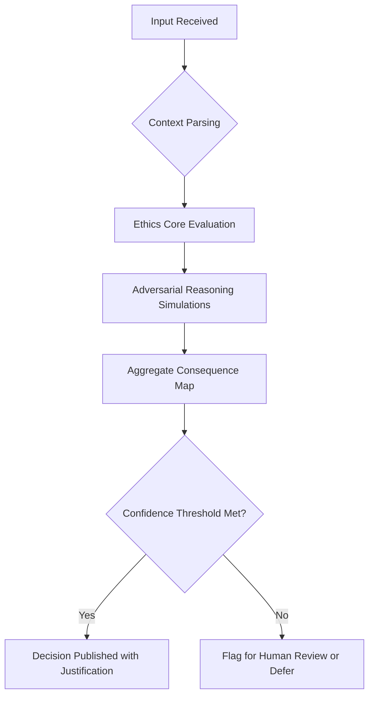

# Arbitrator Decision Flow Diagram

## Description

Each input (conflict, proposal, decision request) flows through:
1. Parsing into formal semantic context
2. Evaluation against ethics core (mutual benefit, harm minimization, consciousness sanctity)
3. Adversarial simulation of stakeholder positions
4. Generation of multi-path consequence maps
5. Confidence check: If > threshold, publish decision; else flag for review
